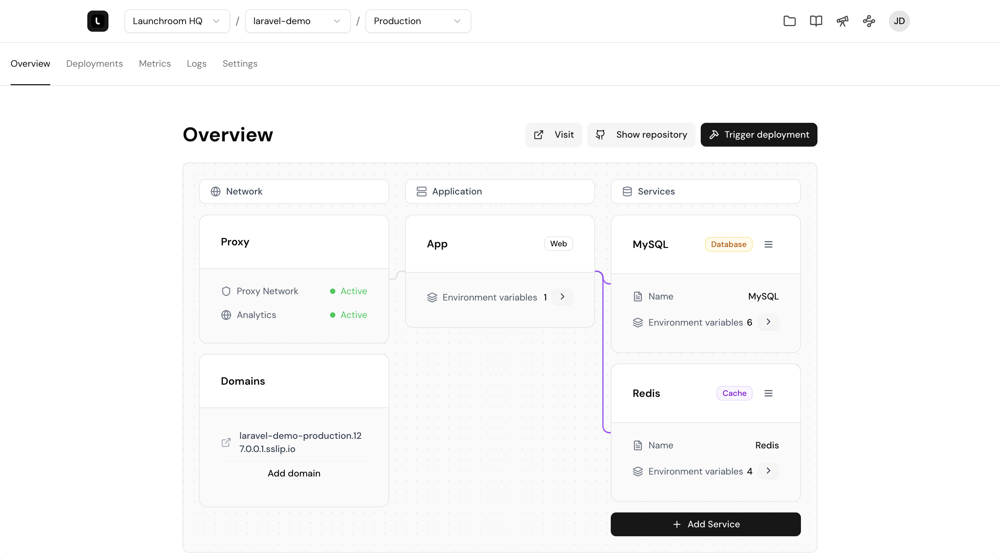

# launchroom

> Framework-first, zero fuss self-hosted deployments

launchroom is an open-source, self-hosted deployment platform built for modern web frameworks. Designed with developers in mind, it automates environment setup, service configuration, and multi-environment management—so you can go from git push to live app without the usual hassle. With native support for Next.js and Laravel (and more on the way), launchroom empowers you to deploy smarter and iterate faster.



## Installation

TBD

## Development

Install Docker, Docker Compose, PHP, Composer, Node.js and NPM.

1. Clone the repository
2. Run these commands:

```bash
# Install dependencies
composer install
npm install

# Setup Laravel
cp .env.example .env
php artisan key:generate
php artisan migrate --seed
php artisan reverb:install -n

# Setup Docker
docker network create launchroom_net
cd resources/docker && docker-compose up -d
```

3. Run `composer run dev` to start the PHP server

Open `http://localhost:8000` in your browser to see the application. You may login with the following credentials:

- Email: `test@example.com`
- Password: `password`
